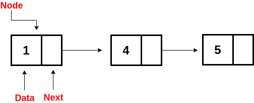
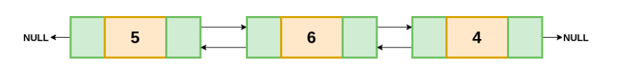
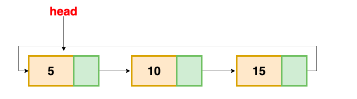

# Linked List

> Before You Destroy A Link; Create The New Link!!!


> Hosted by Sanjay Gharti Magar `Apr 06, 2022`

## What is Linked List?

-   Linked List is a linear collection of data elements.
-   Unlike array, linear order is not given by their physical placement in memory. Instead, each element points to the next node.
-   It is a data structure consisting of a group of nodes which together represent a sequence.
-   Each node is composed of data and a reference (in other words, a link) to the next node in the sequence.
-   Linked List allows for efficient `insertion` or `removal` of elements from any position in the sequence during iteration

## Types of Linked List

1. Singly Linked List
2. Doubly Linked List
3. Circular Linked List

<figure>
    
    <figcaption style="margin-left:20%">Fig.2 Singly Linked List</figcaption>
</figure>

<figure>
    
    <figcaption style="margin-left:20%">Fig.3 Doubly Linked List</figcaption>
</figure>

<figure>
    
    <figcaption style="margin-left:20%">Fig.4 Circular Linked List</figcaption>
</figure>

## Real World Implementation or usecase of Linked List

-   Family Tree - Can be related to tree data structure, since Tree is one of the implementation of Linked List.

-   Train and Conga Line - Each compartment or each person are connected to next and previous node.

-   Music Player - Songs in the music player are linked to the previous and next songs, can play songs either from starting or ending of the list.

-   Image Viewer – Previous and next images are linked, hence can be accessed by the next and previous button.

-   Web Page Browsing History - We can access the previous and next URL searched in a web browser by pressing the back and next buttons since they are doubly Linked List.

-   Undo/Redo of any application, for instance Microsoft Word, Editor etc.

-   GPS Navigation: Travelling from origin to destination is example of traversing through all nodes.

-   Operating System and File System are full of Linked List.

-   <details>
    <summary>Blockchain Technologies</summary>
        Each block contains the information of the parent block that is hashed. The head of the list can be related to the genesis block. The blockchain correctness can be verified by traversing the blocks.
    </details>

-   The packet transmission from one router to another router implements Linked Lists. Each router finds the next hop and the packet travels using the hop information and it reaches you.

## What are the advantages of a Linked List over an Array?

-   **Dynamic data structure**: A Linked List is a dynamic arrangement so it can grow and shrink at runtime by allocating and deallocating memory. So there is no need to give the initial size of the Linked List.

-   **No memory wastage**: In the Linked List, efficient memory utilization can be achieved since the size of the Linked List increase or decrease at run time so there is no memory wastage and there is no need to pre-allocate the memory.

-   **Implementation**: Linear data structures like Stack and Queue are often easily implemented using a Linked List.

-   **Insertion and Deletion Operations**: Insertion and deletion operations are quite easier in the Linked List. There is no need to shift elements after the insertion or deletion of an element, only the address present in the next pointer needs to be updated.

-   Efficient & Fast access to first element (and end if implemented bidirectional)

## What are the disadvantages of a Linked List?

-   **Memory usage**: More memory is required in the Linked List as compared to an array. Because in a Linked List, a pointer is also required to store the address of the next element and it requires extra memory for itself.

-   **Traversal**: In a Linked List, traversal is more time-consuming as compared to an array. Direct access to an element is not possible in a Linked List as in an array by index. For example, for accessing a node at position n, one has to traverse all the nodes before it.

-   **Reverse Traversing**: In a singly Linked List, reverse traversing is not possible, but in the case of a doubly-Linked List, it can be possible as it contains a pointer to the previously connected nodes with each node. For performing this, extra memory is required for the back pointer hence, there is a wastage of memory.

-   **Random Access**: Random access is not possible in a Linked List due to its dynamic memory allocation.

## Basic Operations on Linked List

-   **Traversal**: To traverse all the nodes one after another.
-   **Insertion**: To add a node at the given position.
-   **Deletion**: To delete a node.
-   **Searching**: To search an element(s) by value.
-   **Updating**: To update a node.
-   **Sorting**: To arrange nodes in a linked list in a specific order.
-   **Merging**: To merge two linked lists into one.

## Pseudocode for Basic Operations

### Insert

```Pseudocode
Add(value)
  Pre: value is the value to add to the list
  Post: value has been placed at the tail of the list
  n ← node(value)
  if head = ø
    head ← n
    tail ← n
  else
    tail.next ← n
    tail ← n
  end if
end Add
```

```Pseudocode
Prepend(value)
 Pre: value is the value to add to the list
 Post: value has been placed at the head of the list
 n ← node(value)
 n.next ← head
 head ← n
 if tail = ø
   tail ← n
 end
end Prepend
```

### Search

```Pseudocode
Contains(head, value)
  Pre: head is the head node in the list
       value is the value to search for
  Post: the item is either in the linked list, true; otherwise false
  n ← head
  while n != ø and n.value != value
    n ← n.next
  end while
  if n = ø
    return false
  end if
  return true
end Contains
```

### Delete

```Pseudocode
Remove(head, value)
  Pre: head is the head node in the list
       value is the value to remove from the list
  Post: value is removed from the list, true, otherwise false
  if head = ø
    return false
  end if
  n ← head
  if n.value = value
    if head = tail
      head ← ø
      tail ← ø
    else
      head ← head.next
    end if
    return true
  end if
  while n.next != ø and n.next.value != value
    n ← n.next
  end while
  if n.next != ø
    if n.next = tail
      tail ← n
      tail.next = null
    else
      n.next ← n.next.next
    end if
    return true
  end if
  return false
end Remove
```

### Traverse

```Pseudocode
Traverse(head)
  Pre: head is the head node in the list
  Post: the items in the list have been traversed
  n ← head
  while n != ø
    yield n.value
    n ← n.next
  end while
end Traverse
```

### Traverse in Reverse

```Pseudocode
ReverseTraversal(head, tail)
  Pre: head and tail belong to the same list
  Post: the items in the list have been traversed in reverse order
  if tail != ø
    curr ← tail
    while curr != head
      prev ← head
      while prev.next != curr
        prev ← prev.next
      end while
      yield curr.value
      curr ← prev
    end while
   yield curr.value
  end if
end ReverseTraversal
```

## Complexities

### Time Complexity

| Access | Search | Insertion | Deletion |
| :----: | :----: | :-------: | :------: |
|  O(n)  |  O(n)  |   O(1)    |   O(n)   |

### Space Complexity

O(n)

## Coding

> Talk is cheap. Show me the code. -Linus Torvalds

### Create Node

```python
class Node:
    def __init__(self, data):
        self.data = data
        self.next = None
```

### Linked List

```python
class LinkedList:
    def __init__(self):
        self.head = None
```

### Print List Elements

```python
def print_list(self):
    current_node = self.head
    # while current node is not None
    while current_node:
        print(current_node.data)
        current_node = current_node.next
```

### Prepend

> value has been placed at the head of the list

```python
def prepend(self, data=None):
    new_node = Node(data)

    if self.head is None:
        self.head = new_node
        return

    new_node.next = self.head
    self.head = new_node

```

### Append

> value has been placed at the tail of the list

```python
def append(self, data):
    new_node = Node(data)

    if self.head is None:
        self.head = new_node
        return

    last_node = self.head
    while last_node.next is not None:
        last_node = last_node.next
    last_node.next = new_node
```

### Insert after a node

```python
def insert_after_node(self, prev_node, data):

    if not prev_node:
        print("Previous Node is not in the list 😔")
        return

    new_node = Node(data)
    new_node.next = prev_node.next
    prev_node.next = new_node
```

### Delete Node

```python
def delete_node(self, node):
    current_node = self.head

    # case 1: when delete node is head node
    if current_node is not None and current_node.data == node:
        self.head = current_node.next
        current_node = None
        return

    # case 2: when delete node is not head node
    prev_node = None

    while current_node is not None and current_node.data != node:
        prev_node = current_node
        current_node = current_node.next

    if current_node is None:
        return

    prev_node.next = current_node.next
    current_node = None
```

### Delete Node at Position

```python
def delete_node_at_position(self, position):
    current_node = self.head

    if position == 0:
        self.head = current_node.next
        current_node = None
        return

    prev_node = None
    index = 0
    while current_node is not None and index != position:
        prev_node = current_node
        current_node = current_node.next
        index += 1

    if current_node is None:
        return

    prev_node.next = current_node.next
    current_node = None
```

### Let's run the code

```python
linked_list = LinkedList()
linked_list.append("A")
linked_list.append("B")
linked_list.append("C")
linked_list.append("D")

linked_list.delete_node_at_position(0)
# linked_list.delete_node("D")

# print(linked_list.head.next.next)
# linked_list.insert_after_node(linked_list.head.next, "E")
# linked_list.insert_after_node(linked_list.head.next.next, "E")

linked_list.print_list()
```
